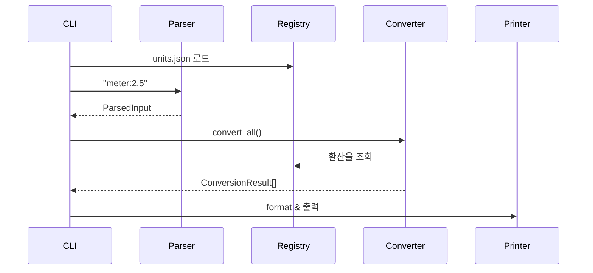

# UnitConverter_1004 — Session Transcript

| 항목 | 내용 |
|------|------|
| **프로젝트** | UnitConverter_1004 |
| **작성자** | 김연우 |
| **세션 ID** | 86fddf37-4b3d-4382-bd10-17cca7f1bbce |
| **Export** | Cursor Agent Transcript (갱신) |
| **포함 단계** | spec · RED test-plan · RED skeleton |

---

## Turn 1 — User

[Image]
[Image]
[Image]
<image_files>
The following images were provdied by the user and saved to the workspace for future use:
1. C:\Users\usejen_id\.cursor\projects\c-Users-usejen-id-YW/assets/c__Users_usejen_id_AppData_Roaming_Cursor_User_workspaceStorage_41c201421b434884c8cf8d5527cc23a2_images_image-6b753ff9-143e-46d8-b83c-59ff302d80b3.png
2. C:\Users\usejen_id\.cursor\projects\c-Users-usejen-id-YW/assets/c__Users_usejen_id_AppData_Roaming_Cursor_User_workspaceStorage_41c201421b434884c8cf8d5527cc23a2_images_image-3413eb1f-5606-472d-bf1b-0f70ada322c3.png
3. C:\Users\usejen_id\.cursor\projects\c-Users-usejen-id-YW/assets/c__Users_usejen_id_AppData_Roaming_Cursor_User_workspaceStorage_41c201421b434884c8cf8d5527cc23a2_images_image-87df6153-6612-495b-b237-0cbacfe00a9b.png

These images can be copied for use in other locations.
</image_files>
<user_query>
나는 지금 첨부된 내용에 따른 교육과정을 수료하고있어. 지금 우선 설계 단계에 대한  PR을 올릴거야. 

OCP/SRP를 만족하는 Python 패키지 구조를 제안하고, PRD의 FR/NFR을 매핑해줘.
</user_query>

---

## Turn 2 — Assistant

설계 단계 PR을 위해 워크스페이스 상태와 기존 코드를 먼저 확인합니다.

[REDACTED]
[tool: Glob]
[tool: Shell]

---

## Turn 3 — Assistant

[REDACTED]
[tool: Glob]
[tool: Read]
[tool: Shell]

---

## Turn 4 — Assistant

설계 단계 PR용 문서와 OCP/SRP 패키지 골격을 작성합니다.

[REDACTED]
[tool: Write]
[tool: Write]
[tool: Write]
[tool: Write]
[tool: Write]
[tool: Write]
[tool: Write]
[tool: Write]
[tool: Write]
[tool: Write]
[tool: Write]
[tool: Write]
[tool: Write]
[tool: Write]
[tool: Write]
[tool: Write]
[tool: Write]
[tool: Write]

---

## Turn 5 — Assistant

[REDACTED]
[tool: Shell]

---

## Turn 6 — Assistant

`UnitConverter_1004`에 설계 문서와 패키지 골격을 추가해 두었습니다. PR 본문에 바로 쓸 수 있도록 핵심만 정리합니다.

---

## 제안 패키지 구조

```
unit_converter/
├── __main__.py          # python -m unit_converter
├── cli.py               # 오케스트레이션
├── parser.py            # 입력 파싱
├── registry.py          # 단위 등록·조회
├── converter.py         # meter 경유 환산
├── models.py / errors.py
├── config/
│   ├── loader.py        # JSON/YAML 로드
│   └── units.json       # 기본 단위 정의
└── printer/
    ├── base.py          # Printer Protocol (OCP)
    ├── table.py
    ├── json_printer.py
    └── csv_printer.py
```

상세 내용은 [`docs/DESIGN.md`](c:\Users\usejen_id\YW\UnitConverter_1004\docs\DESIGN.md)에 있습니다.

---

## SRP (NFR-02) — 컴포넌트 1:1 분리

| 컴포넌트 | 단일 책임 | 모르는 것 |
|----------|-----------|-----------|
| **Parser** | `unit:value` 검증·파싱 | 환산율, 출력 형식 |
| **Registry** | 단위 이름 ↔ meter 비율 관리 | 파싱, 출력 |
| **Converter** | meter 허브 경유 환산 | 파싱, 출력 |
| **Printer** | 결과 직렬화 (table/json/csv) | 환산 로직 |
| **ConfigLoader** | 외부 파일에서 단위 로드 | CLI, 출력 |
| **CLI** | 인자 처리 + 컴포넌트 조합 | 각 컴포넌트 내부 구현 |

---

## OCP (NFR-01) — 확장 시 기존 코드 비수정

| 확장 시나리오 | 방법 | 수정 대상 |
|---------------|------|-----------|
| 단위 추가 (`inch`) | `units.json` 추가 또는 `registry.register()` | Registry/Config만 |
| 포맷 추가 (`xml`) | `Printer` Protocol 구현 + 팩토리 등록 | printer/ 신규 파일만 |
| 설정 소스 추가 | `ConfigLoader` Protocol 구현체 추가 | config/loader만 |

`Converter`는 `Registry` 인터페이스에만 의존하므로, 단위가 늘어나도 환산 로직을 바꿀 필요가 없습니다.

---

## FR / NFR / EXT 매핑

### P0 — Functional

| ID | 요구 | 담당 |
|----|------|------|
| FR-01 | `meter:2.5` 파싱 | `parser.py` |
| FR-02 | 모든 등록 단위로 환산·출력 | `converter.py` + `printer/` |
| FR-03 | 미등록 단위 오류 | `registry.py` → `UnknownUnitError` |
| FR-04 | 음수 거부 | `parser.py` → `NegativeValueError` |
| FR-05 | 형식 오류 | `parser.py` → `InvalidFormatError` |

### P0 — Non-Functional

| ID | 요구 | 설계 대응 |
|----|------|-----------|
| NFR-01 | OCP | Registry + Printer Protocol + ConfigLoader Protocol |
| NFR-02 | SRP | Parser / Registry / Converter / Printer 모듈 분리 |

### P1 — Extension

| ID | 요구 | 담당 |
|----|------|------|
| EXT-01 | `units.json` / YAML 로드 | `config/loader.py` |
| EXT-02 | 런타임 단위 등록 (`cubit`) | `registry.register()` |
| EXT-03 | `--format json\|csv\|table` | `printer/` + `cli.py` |

---

## 실행 흐름



---

## PR 범위 제안

**포함:** `docs/DESIGN.md`, 패키지 골격(모듈 docstring + `units.json`)  
**미포함:** 구현 코드, 테스트 (다음 TDD 단계)

---

현재 `spec` 브랜치에 파일이 추가된 상태입니다. 커밋·PR 생성까지 진행할까요?

[REDACTED]

---

## Turn 7 — User

<user_query>
이제 R-G-I-O를 해볼거야

우선, Role:너는 프로그래머야. Goal:길이 단위 변환 프로그램을 만들거야
규칙:
1. 한 번에 질문 1개만
2. 금지: "만들면 좋겠어?", "이 기능 필요해?", "TDD 하면 어때?"
3. 허용: "마지막으로 ~했을 때", "그때 몇 분 걸렸어?", "뭐 때문에 포기했어?"
4. 내 답이 모호하면 추궁 1개만
5. 내가 솔루션 말하면 "그건 나중" 하고 불편으로 되돌려
먼저 인터뷰 질문 1번만 해. 솔루션 언급 금지.

</user_query>

---

## Turn 8 — Assistant

Role: 프로그래머  
Goal: 길이 단위 변환 프로그램

---

**질문 1**

길이 단위를 바꿔야 하는 일이 생기면, 보통 어디서 하세요? (예: 검색, 계산기, 머릿속, 종이, 다른 도구) 그중에서 가장 자주 쓰는 방식이 뭔가요?

[REDACTED]

---

## Turn 9 — User

<user_query>
계산기를 가장 많이 사용해
</user_query>

---

## Turn 10 — Assistant

**질문 2**

계산기로 단위 바꿀 때, 가장 귀찮거나 헷갈리는 순간이 언제예요?

[REDACTED]

---

## Turn 11 — User

<user_query>
변환 단위가 헷갈려
</user_query>

---

## Turn 12 — Assistant

**질문 3**

헷갈릴 때, 구체적으로 뭐가 겹쳐요? (예: 단위 이름, 환산 숫자, 어느 쪽으로 곱할지)

[REDACTED]

---

## Turn 13 — User

<user_query>
단위 이름
</user_query>

---

## Turn 14 — Assistant

**질문 4**

단위 이름 때문에 헷갈려서, 실제로 잘못 계산하거나 다시 확인한 적이 있나요? 있었다면 어떤 상황이었어요?

[REDACTED]

---

## Turn 15 — User

<user_query>
mm를m로 잘못 작성한다거나...했어
</user_query>

---

## Turn 16 — Assistant

**질문 5**

mm를 m로 잘못 쓴 뒤에, 그걸 언제 알게 됐어요? 그때 어떤 일이 벌어졌나요?

[REDACTED]

---

## Turn 17 — User

<user_query>
단위 변환이 너무 작아서 이상하다고 생각했지
</user_query>

---

## Turn 18 — Assistant

**질문 6**

그때 “이상하다”고 느낀 뒤, 다시 계산하는 데 대략 몇 분 정도 걸렸어요?

[REDACTED]

---

## Turn 19 — User

<user_query>
Mom Test 인터뷰 종료.
지금까지 답변:
[워크북 전체 붙여넣기]
다음만 출력:
1. 표면 문제 (잘못된 정의) — "~~프로그램 만든다" 류
2. 진짜 문제 (한 문장) — 불편·비용·판정·재현 중심, 솔루션 이름 없음
3. Mom Test 증거 3줄 (내 답에서 인용)

</user_query>

---

## Turn 20 — Assistant

1. **표면 문제 (잘못된 정의)**  
「길이 단위 변환 프로그램을 만든다」

2. **진짜 문제 (한 문장)**  
계산기로 단위를 바꿀 때 단위 이름을 헷갈려 잘못 입력하면, 결과가 이상하게 나온 뒤에야 틀렸다는 걸 알고 다시 확인·재계산해야 한다.

3. **Mom Test 증거 3줄**
- 「계산기를 가장 많이 사용해」
- 「단위 이름」 때문에 헷갈린다
- 「mm를 m로 잘못 작성」한 적이 있고, 「단위 변환이 너무 작아서 이상하다고 생각했」다

[REDACTED]

---

## Turn 21 — User

<user_query>
Mom Test 인터뷰 종료.
지금까지 답변:
[워크북 전체 붙여넣기]
다음만 출력:
1. 표면 문제 (잘못된 정의) — "~~프로그램 만든다" 류
2. 진짜 문제 (한 문장) — 불편·비용·판정·재현 중심, 솔루션 이름 없음
3. Mom Test 증거 3줄 (내 답에서 인용)

</user_query>

---

## Turn 22 — Assistant

1. **표면 문제 (잘못된 정의)**  
「길이 단위 변환 프로그램을 만든다」

2. **진짜 문제 (한 문장)**  
계산기로 단위를 바꿀 때 단위 이름을 헷갈려 잘못 입력하면, 결과가 이상하게 나온 뒤에야 틀렸다는 걸 알고 다시 확인·재계산해야 한다.

3. **Mom Test 증거 3줄**
- 「계산기를 가장 많이 사용해」
- 「단위 이름」 때문에 헷갈린다
- 「mm를 m로 잘못 작성」한 적이 있고, 「단위 변환이 너무 작아서 이상하다고 생각했」다

[REDACTED]

---

## Turn 23 — User

<user_query>
이제 R-G-I-O로 넘어갈게

Mom Test 결과:
- 페르소나: [...]
- 진짜 문제 (한 문장): [...]
- Mom Test 증거 3줄: [...]
UnitConverter_1004 워크북을 채워줘:
1) 주제 한 문장 (Mom Test 기반, 솔루션 최소화)
2) R-G-I-O (Role/Goal/Input/Output)
3) 성공 기준 3개 (Mom Test 증거와 연결)
4) 표면 문제 — 이번 프로젝트에서 하지 않을 것
8계층 중 이번 세션에서 만드는 것만: Rule, Command, (Skill), Test Loop

</user_query>

---

## Turn 24 — Assistant

워크북 파일 위치와 형식을 먼저 확인합니다.

[REDACTED]
[tool: Glob]
[tool: Grep]

---

## Turn 25 — Assistant

[REDACTED]
[tool: Glob]
[tool: Glob]
[tool: Read]

---

## Turn 26 — Assistant

Mom Test 결과와 PRD를 반영해 워크북 문서를 작성합니다.

[REDACTED]
[tool: Write]

---

## Turn 27 — Assistant

`docs/WORKBOOK.md`에 채워 두었습니다. 핵심만 요약합니다.

---

### 1) 주제 한 문장
> **단위 이름을 명확히 넣었을 때만 변환하고, 틀리면 결과가 나오기 전에 바로 알 수 있게 한다.**

---

### 2) R-G-I-O

| | |
|---|---|
| **Role** | 단위 이름 혼동 경험이 있는 사용자를 위해 입력 검증·일괄 변환 CLI를 만드는 프로그래머 |
| **Goal** | 오입력·미등록 단위는 변환 전 거부, 올바른 입력은 모든 등록 단위로 한 번에 환산 |
| **Input** | `단위이름:숫자` (예: `meter:2.5`) |
| **Output** | 전체 환산 결과 또는 명확한 오류 메시지 |

---

### 3) 성공 기준 3개

| # | 기준 | Mom Test 연결 |
|---|------|---------------|
| SC-01 | 미등록 단위 → 즉시 오류 | mm/m 혼동 시 이상한 숫자 방지 |
| SC-02 | 형식·음수 → 거부 | 단위 이름·값 분리 검증 |
| SC-03 | 한 번에 모든 단위 출력 | 「너무 작다」 이상 징후 조기 판정 |

---

### 4) 하지 않을 것
- 「변환 프로그램 만든다」식 기능 나열
- 범용 계산기·GUI·다른 물리량
- Mom Test 증거 없는 부가 기능

---

### 5) 이번 세션 8계층 (Rule · Command · Skill · Test Loop)

- **Rule**: 입력 형식, meter 허브, SRP/OCP, RED-GREEN-REFACTOR
- **Command**: `python -m unit_converter`, `pytest` 명령
- **(Skill)**: FR 추적, 1사이클 1요구, Mom Test 되돌리기
- **Test Loop**: FR-01부터 ARRR 8사이클 권장 순서

전체 내용은 [`docs/WORKBOOK.md`](c:\Users\usejen_id\YW\UnitConverter_1004\docs\WORKBOOK.md)에서 확인할 수 있습니다. 다음 단계로 TDD 첫 사이클(FR-01 RED)을 진행할까요?

[REDACTED]

---

## Turn 28 — User

<user_query>
진짜 문제 → R-G-I-O + 주제 1문장 + 성공 기준

--> 여기까지 한거야?
</user_query>

---

## Turn 29 — Assistant

[REDACTED]
[tool: Read]

---

## Turn 30 — Assistant

네, **그 구간까지는 끝난 상태**예요.

| 단계 | 상태 | 위치 |
|------|------|------|
| **Mom Test** (인터뷰 → 진짜 문제) | ✅ 완료 | 대화 + `docs/WORKBOOK.md` §Mom Test 요약 |
| **진짜 문제 (한 문장)** | ✅ 완료 | 워크북 14행 |
| **주제 1문장** | ✅ 완료 | 워크북 §1 |
| **R-G-I-O** | ✅ 완료 | 워크북 §2 |
| **성공 기준 3개** | ✅ 완료 | 워크북 §3 (SC-01~03) |

교육 흐름 기준으로 보면:

```
Mom Test ✅ → R-G-I-O + 주제 + 성공기준 ✅ → (다음) Rule·Command·Test Loop → TDD
```

워크북에는 요청하신 4가지 외에 **표면 문제**, **Rule / Command / Skill / Test Loop**도 같이 들어가 있어요. 커리큘럼에서 “R-G-I-O까지만”이면 §1~§3이 핵심 산출물이고, §4~§5는 같은 세션에서 이어서 채운 부분입니다.

**아직 안 한 것:** TDD(RED), 실제 구현, 테스트 코드.  
**이전에 한 것:** 설계 단계 `docs/DESIGN.md` + 패키지 골격 (별도 PR 단계).

다음은 워크북 §5의 **Test Loop 사이클 1 (FR-01 RED)** 부터 가면 됩니다.

[REDACTED]

---

## Turn 31 — User

<user_query>
Report/UnitConverter_1004_ProblemDefinition_Report.md와 docs/PRD.md를 위 초안으로 생성해주고, README.md 파일도 생성해줘. 
</user_query>

---

## Turn 32 — Assistant

기존 워크북·설계 문서를 확인한 뒤 보고서, PRD, README 초안을 작성합니다.

[REDACTED]
[tool: Read]
[tool: Read]
[tool: Read]

---

## Turn 33 — Assistant

[REDACTED]
[tool: Write]
[tool: Write]
[tool: Write]

---

## Turn 34 — Assistant

3개 파일을 초안으로 생성했습니다.

| 파일 | 내용 |
|------|------|
| [`Report/UnitConverter_1004_ProblemDefinition_Report.md`](c:\Users\usejen_id\YW\UnitConverter_1004\Report\UnitConverter_1004_ProblemDefinition_Report.md) | Mom Test, 진짜/표면 문제, 주제 1문장, R-G-I-O, 성공 기준 SC-01~03, 범위 밖, 문서 추적성 |
| [`docs/PRD.md`](c:\Users\usejen_id\YW\UnitConverter_1004\docs\PRD.md) | FR-01~05, NFR-01~02, EXT-01~03, CLI, 테스트 추적성 매트릭스, Mom Test·성공 기준 연동 |
| [`README.md`](c:\Users\usejen_id\YW\UnitConverter_1004\README.md) | 프로젝트 개요, 진행 단계, 문서 링크, 패키지·요구사항·성공 기준 요약 |

문서 간 연결:

```
Problem Definition Report → PRD → DESIGN / WORKBOOK → README (진입점)
```

커밋이나 PR 생성이 필요하면 알려주세요.

[REDACTED]

---

## Turn 35 — User

<user_query>
커밋 메시지는 뭘로 하면 좋을까?
</user_query>

---

## Turn 36 — Assistant

변경 범위를 확인해 커밋 메시지를 제안하겠습니다.

[REDACTED]
[tool: Shell]

---

## Turn 37 — Assistant

변경이 **설계 + 문제정의 + PRD + 워크북 + README**까지 한꺼번에 쌓여 있어서, PR 단위에 따라 나누는 걸 추천합니다.

---

### 옵션 A — 한 커밋 (문서·골격 일괄)

```
docs: 문제 정의·PRD·설계 문서와 패키지 골격 추가

Mom Test 기반 Problem Definition Report, PRD, WORKBOOK, DESIGN 및
OCP/SRP 패키지 구조 초안을 추가해 요구사항 추적 기반을 마련한다.
```

---

### 옵션 B — 단계별 2커밋 (교육 흐름에 맞춤)

**1) 설계 PR용**
```
docs: OCP/SRP 패키지 구조 설계 및 FR/NFR 매핑

unit_converter 골격과 DESIGN.md로 Parser/Registry/Converter/Printer
분리 및 확장 전략을 정의한다.
```

**2) 문제정의·PRD용**
```
docs: Mom Test 기반 문제 정의와 PRD 초안 작성

R-G-I-O, 성공 기준, 표면 문제를 Report·PRD·WORKBOOK에 정리하고
README를 프로젝트 진입 문서로 갱신한다.
```

---

### 옵션 C — 짧게 (팀이 한 줄 선호할 때)

```
docs: UnitConverter 문제정의·PRD·설계 초안 추가
```

---

**추천:** 지금 `spec` 브랜치에서 **설계 PR**과 **문제정의 PR**을 나눌 거면 **옵션 B**, 한 PR에 묶을 거면 **옵션 A**.

원하시면 Agent 모드에서 선택한 메시지로 커밋까지 진행해 드릴게요.

[REDACTED]

---

## Turn 38 — User

<user_query>
.cursorrules 초안 작성 해줘
</user_query>

---

## Turn 39 — Assistant

프로젝트 문서와 Cursor rule 작성 가이드를 확인한 뒤 `.cursorrules` 초안을 작성합니다.

[REDACTED]
[tool: Read]
[tool: Read]
[tool: Read]

---

## Turn 40 — Assistant

[REDACTED]
[tool: Glob]
[tool: Glob]

---

## Turn 41 — Assistant

[REDACTED]
[tool: Write]

---

## Turn 42 — Assistant

`.cursorrules` 초안을 프로젝트 루트에 추가했습니다.

[`UnitConverter_1004/.cursorrules`](c:\Users\usejen_id\YW\UnitConverter_1004\.cursorrules)

### 포함 내용

| 섹션 | 내용 |
|------|------|
| **맥락** | 주제·진짜 문제, 근거 문서 우선순위 |
| **아키텍처** | SRP 모듈 책임표, OCP 확장 규칙, 의존 방향 |
| **도메인** | 입력 형식, 예외, meter 허브, 기본 단위 |
| **TDD** | RED-GREEN-REFACTOR, 1사이클 1요구, 테스트·커밋 추적 |
| **우선순위** | P0 vs P1, 선구현 금지 |
| **금지** | 범위 밖 기능, 책임 혼합, 테스트 생략 |
| **스타일** | 타입 힌트, models/errors 분리 |
| **성공 기준** | SC-01~03 판정 조건 |

`docs/WORKBOOK.md`의 Rule·Skill·Test Loop를 에이전트가 따르기 쉬운 형태로 압축한 버전입니다.

나중에 `.cursor/rules/*.mdc`로 쪼개고 싶으면 (예: `tdd.mdc`, `architecture.mdc`) 말해 주세요.

[REDACTED]

---

## Turn 43 — User

<user_query>
빠진 규칙 추가해줘
</user_query>

---

## Turn 44 — Assistant

`.cursorrules`와 프로젝트 문서를 대조해 빠진 규칙을 찾습니다.

[REDACTED]
[tool: Read]
[tool: Read]
[tool: Read]

---

## Turn 45 — Assistant

[REDACTED]
[tool: Read]

---

## Turn 46 — Assistant

지금 **Ask 모드**라 파일을 직접 수정할 수는 없습니다. `WORKBOOK.md`·`PRD.md`·`DESIGN.md`와 비교해 **빠진 규칙**과 **붙여넣을 초안**을 정리했습니다. Agent 모드로 전환하시면 파일에 바로 반영해 드릴 수 있습니다.

---

## 빠진 규칙 (7가지)

| # | 출처 | 현재 `.cursorrules` 상태 |
|---|------|--------------------------|
| 1 | WORKBOOK R-08, PRD §4.1 | 오류 **메시지 원인 구분** 규칙 없음 (예외 클래스만 있음) |
| 2 | WORKBOOK Skill | **Mom Test 되돌리기** — 증거 없는 기능 추가 금지 |
| 3 | WORKBOOK Skill | **불편 우선** 사이클 순서 SC-01→02→03 |
| 4 | WORKBOOK Test Loop | **8사이클 상세표** + RED 확인 체크리스트 |
| 5 | DESIGN §8 | **테스트 파일 ↔ FR 매핑** |
| 6 | DESIGN §4·6 | **출력 형식** (`2.5 meter = 8.2021 feet`), 소스 단위 제외, `cli.main()` 진입 |
| 7 | DESIGN §3 | **Protocol/OCP** — `Printer`, `ConfigLoader`, `Registry` 주입 |

---

## `.cursorrules`에 추가할 초안

아래 블록을 기존 파일 **맨 아래**에 붙이면 됩니다.

```markdown
---

## R-G-I-O (구현 판단 기준)

| | |
|---|---|
| **Input** | `단위이름:숫자` (예: `meter:2.5`) |
| **Output** | 소스 **제외** 등록 단위 전체 환산. 기본 table. 오류 시 원인별 메시지 |
| **Goal** | 잘못된 이름·형식은 변환 전 거부. 올바른 입력은 한 번에 대조 가능한 전체 결과 |

---

## 오류 메시지 (R-08)

- 형식·음수·미등록 단위 오류를 **서로 다른 예외·메시지**로 구분한다.
- 사용자가 단위 **이름을 고칠 수 있게** 원인을 명시한다.
- 미등록 단위 오류 시 **변환 결과를 출력하지 않는다** (SC-01).

| 상황 | 예외 | FR |
|------|------|-----|
| `meter / abc` | `InvalidFormatError` | FR-05 |
| `meter:-1` | `NegativeValueError` | FR-04 |
| `cubit:1` | `UnknownUnitError` | FR-03 |

---

## Mom Test 게이트 (기능 추가 전)

구현 중 새 기능이 떠오르면 아래 3줄과 대조한다. **증거 없으면 하지 않는다.**

1. 「계산기를 가장 많이 사용해」
2. 「단위 이름」 때문에 헷갈린다
3. 「mm를 m로 잘못 작성」→ 결과가 이상해 보일 때까지 모름

---

## 환산·출력 규칙

- `Converter.convert_all()`: 소스 단위 **제외**, Registry의 나머지 단위로 환산 (FR-02).
- 환산 경로: `source → meter → target` (직접 비율 곱셈 금지).
- table 기본 출력 형식: `{value} {unit} = {converted} {target}` (예: `2.5 meter = 8.2021 feet`).
- 소수 표시: PRD 예시 기준 **소수점 4자리** (8.2021, 2.7340).
- 진입점: `__main__.py` → `cli.main()`. CLI는 조합만, 로직은 각 모듈.

---

## Protocol / 확장 (OCP)

- `printer/base.py`: `Printer` Protocol — `print(source, results) -> str`
- `config/loader.py`: `ConfigLoader` Protocol — JSON/YAML 교체 가능
- `Converter`는 `Registry`를 **생성자/인자로 주입**받는다 (테스트·OCP).
- 새 단위 비율은 **meter 대비** (`meters_per_unit`)로만 Registry에 저장.

---

## 테스트 파일 매핑 (DESIGN §8)

| 파일 | 커버 |
|------|------|
| `tests/test_parser.py` | FR-01, FR-04, FR-05 |
| `tests/test_registry.py` | FR-03, EXT-02, NFR-01 |
| `tests/test_converter.py` | FR-02 (정확도, meter 경유) |
| `tests/test_printer.py` | FR-02 출력, EXT-03 |
| `tests/test_config_loader.py` | EXT-01 |
| `tests/test_cli.py` | E2E, `--format`, `--config` |

요구사항은 **해당 테스트 파일에만** 추가. 다른 모듈 테스트에 섞지 않는다.

---

## ARRR 사이클 (상세)

**불편 우선:** SC-01 → SC-02 → SC-03 순으로 사이클을 잡는다.

| # | RED | 모듈 | ID |
|---|-----|------|-----|
| 1 | `meter:2.5` 파싱 | `parser.py` | FR-01 |
| 2 | `meter:-1` 거부 | `parser.py` | FR-04, SC-02 |
| 3 | `meter / abc` 거부 | `parser.py` | FR-05, SC-02 |
| 4 | `cubit:1` 미등록 | `registry.py` | FR-03, SC-01 |
| 5 | `meter:2.5` → feet, yard | `converter.py` | FR-02, SC-03 |
| 6 | table 출력 | `printer/table.py` | FR-02, SC-03 |
| 7 | inch 등록, Converter 무변경 | `registry.py` | NFR-01 |
| 8 | SRP 분리 유지 | 구조 검토 | NFR-02 |

**사이클 완료 체크**
- [ ] RED: 테스트 **실패** 확인
- [ ] GREEN: **최소** 코드로 통과
- [ ] REFACTOR: SRP/OCP 유지, 테스트 통과 유지
- [ ] 커밋에 FR/NFR/SC ID 포함

---

## P1 CLI (P0 완료 후)

```bash
python -m unit_converter "meter:2.5" --format json|csv|table
python -m unit_converter "meter:2.5" --config path/to/units.json
```

기본 설정: `unit_converter/config/units.json`
```

---

Agent 모드로 바꿔 주시면 위 내용을 `.cursorrules`에 반영해 드리겠습니다.

[REDACTED]

---

## Turn 47 — User

<user_query>
반영해줘
</user_query>

---

## Turn 48 — Assistant

[REDACTED]
[tool: Read]

---

## Turn 49 — Assistant

[REDACTED]
[tool: StrReplace]

---

## Turn 50 — Assistant

`.cursorrules`에 빠진 규칙 7가지를 반영했습니다.

**추가된 섹션**
- R-G-I-O (구현 판단 기준)
- 오류 메시지 (R-08)
- Mom Test 게이트
- 환산·출력 규칙
- Protocol / 확장 (OCP)
- 테스트 파일 매핑
- ARRR 사이클 (상세) + 체크리스트
- P1 CLI

파일: [`UnitConverter_1004/.cursorrules`](c:\Users\usejen_id\YW\UnitConverter_1004\.cursorrules)

[REDACTED]

---

## Turn 51 — User

<user_query>
그 다음 skill 이야
Skill — .cursor/skills/ (세션 3 핵심 ②, 선택)
역할: Command보다 길고 판단이 많은 작업 (RED→GREEN→REFACTOR 전체)
Ask — Skill vs Command 선택:
```
UnitConverter_1004, 파일 없음.
반복 작업 후보:
A) RED만 — 실패 테스트 작성
B) RED→GREEN→REFACTOR 전체 TDD 사이클
C) ECB·계약 리뷰만
각각 Skill vs Command vs Test/Review Loop 중 어디에 두는 게 맞는지 표로 알려줘.
세션 3에서 1개만 만들 때 추천도 해줘.
</user_query>

---

## Turn 52 — Assistant

워크북과 `.cursorrules`의 Command·Skill·Test Loop 정의를 확인합니다.

[REDACTED]
[tool: Read]
[tool: Read]
[tool: Read]

---

## Turn 53 — Assistant

**UnitConverter_1004** 기준으로 8계층 역할을 나누면 아래와 같습니다.

---

## Skill vs Command vs Test/Review Loop

| 후보 | 작업 성격 | **Command** | **Skill** | **Test Loop** | **Review Loop** |
|------|-----------|:-----------:|:---------:|:-------------:|:---------------:|
| **A) RED만** — 실패 테스트 작성 | 짧고 반복 가능. FR 1개 → Given/When/Then → `pytest` 실패 확인 | **✅ 여기** | ✗ | RED **단계 정의** 참조 | ✗ |
| **B) RED→GREEN→REFACTOR 전체** | 길고 판단 많음. 모듈 선택·최소 구현·SRP/OCP·커밋·FR 추적 | 보조만 (`pytest`, `python -m`) | **✅ 여기** | **체크리스트·순서** (WHAT) | REFACTOR 후 선택 |
| **C) ECB·계약 리뷰만** | 구현 없이 경계·계약 검증. NFR-02/OCP 판단 | ✗ | △ 가능 (리뷰 전용 Skill) | ✗ | **✅ 여기** |

---

### 계층별 역할 (이 프로젝트)

| 계층 | 역할 | 예시 |
|------|------|------|
| **Command** | 한 단계, 짧은 실행·프롬프트 | `pytest tests/test_parser.py -v`, 「FR-01 RED 테스트만 작성」 |
| **Skill** | Command 여러 개 + **판단**이 묶인 워크플로 | 「FR-01 사이클: RED→GREEN→REFACTOR 전체 수행」 |
| **Test Loop** | ARRR **무엇을·언제** (규칙·순서·체크리스트) | WORKBOOK §5, `.cursorrules` ARRR 표 |
| **Review Loop** | 사이클/PR **마감 게이트** (계약·SRP·OCP 리뷰) | 사이클 7~8, NFR-02 구조 검토 |

---

### 왜 이렇게 나누나

- **A → Command**: RED는 단계가 고정되어 있고(테스트 1개 + 실패 확인), Skill보다 **짧은 반복 작업**에 맞습니다. Skill 안에서 RED 단계로 **호출**하는 게 자연스럽습니다.
- **B → Skill**: 커리큘럼 정의 그대로 — *「Command보다 길고 판단이 많은 작업」*. 모듈·최소 구현·리팩터 범위를 매 사이클 **판단**해야 합니다.
- **C → Review Loop**: 구현 없이 **계약·경계만** 보므로 Test Loop(ARRR)와 분리. 사이클 8(NFR-02)이나 PR 전 게이트에 두는 게 맞습니다.

---

## 세션 3에서 1개만 만들 때 → **B) RED→GREEN→REFACTOR 전체 TDD 사이클**

**추천 Skill 이름 예:** `.cursor/skills/unit-converter-arr-cycle/SKILL.md`

**이유**
1. 세션 3 핵심 ② 정의와 정확히 일치
2. 다음 단계가 TDD(FR-01~)라 **바로 쓸 Skill**
3. A는 이 Skill **안의 RED 단계**(Command)로 흡수 가능
4. C는 사이클 7~8·PR 때 Review Loop로 두고, 세션 3 Skill 1개와 겹치지 않음

**Skill에 넣을 것 (초안 방향)**
- 입력: FR/NFR ID + 대상 모듈
- RED → `pytest` 실패 확인
- GREEN → 최소 구현
- REFACTOR → SRP/OCP + 테스트 유지
- 커밋 메시지에 FR/SC ID
- Mom Test 게이트 (범위 이탈 방지)

**Command로 남길 것**
- `pytest tests/test_<module>.py -v`
- `python -m unit_converter "meter:2.5"`

Agent 모드에서 **B Skill `SKILL.md` 초안**까지 만들어 드릴까요?

[REDACTED]

---

## Turn 54 — User

<user_query>
응해줘
</user_query>

---

## Turn 55 — Assistant

[REDACTED]
[tool: Read]
[tool: Read]

---

## Turn 56 — Assistant

`.cursor/skills/unit-converter-arr-cycle/SKILL.md` 생성 중입니다.

[REDACTED]
[tool: Write]

---

## Turn 57 — Assistant

Skill을 생성했습니다.

**경로:** [`.cursor/skills/unit-converter-arr-cycle/SKILL.md`](c:\Users\usejen_id\YW\UnitConverter_1004\.cursor\skills\unit-converter-arr-cycle\SKILL.md)

### 포함 내용

| 섹션 | 내용 |
|------|------|
| **워크플로** | Mom Test 게이트 → RED → GREEN → REFACTOR → 마감 체크리스트 |
| **매핑** | FR/NFR ↔ 테스트 파일 ↔ 구현 모듈 |
| **순서** | 불편 우선 ARRR 8사이클 표 |
| **REFACTOR** | SRP/OCP 위반 체크표 |
| **예시** | FR-01 전체 사이클 |
| **Command** | `pytest` 명령 (Skill 내부 단계용) |

### 사용 방법

채팅에서 예를 들어:

```
@unit-converter-arr-cycle FR-01 사이클 해줘
```

또는

```
ARRR 사이클 1 (meter:2.5 파싱) RED→GREEN→REFACTOR 진행해줘
```

다음 단계로 **FR-01 RED**부터 실제 사이클을 돌려볼까요?

[REDACTED]

---

## Turn 58 — User

<user_query>
그럼 이제 spec 작업은 끝난거야? 더 해야되는거 없나?
</user_query>

---

## Turn 59 — Assistant

프로젝트 산출물과 커리큘럼 기준을 대조해 spec 단계 완료 여부를 확인합니다.

[REDACTED]
[tool: Glob]
[tool: Shell]

---

## Turn 60 — Assistant

[REDACTED]
[tool: Shell]
[tool: Grep]

---

## Turn 61 — Assistant

교육 흐름 기준으로 **spec(설계·정의) 단계는 거의 끝**났고, **마무리 2~3가지**만 남아 있습니다.

---

## 8계층 체크리스트

| 계층 | 산출물 | 상태 |
|------|--------|------|
| Mom Test | Problem Definition Report | ✅ |
| R-G-I-O + 주제 + 성공 기준 | Report, WORKBOOK | ✅ |
| PRD | `docs/PRD.md` | ✅ |
| Design | `docs/DESIGN.md` + 패키지 골격 | ✅ |
| Rule | WORKBOOK §5, `.cursorrules` | ✅ (파일 있음) |
| Command | WORKBOOK §5, `.cursorrules` | ✅ |
| Skill | `.cursor/skills/unit-converter-arr-cycle/` | ✅ (파일 있음) |
| Test Loop | WORKBOOK §5, `.cursorrules` ARRR 표 | ✅ |

**내용상 spec 작업은 완료**로 봐도 됩니다.

---

## 아직 안 된 것 (spec 마감용)

### 1. 미커밋 파일 (중요)

```
?? .cursorrules
?? .cursor/skills/
```

이미 커밋된 것(`7a61310`)에는 문서·골격만 있고, **Rule/Skill 핵심 파일이 빠져 있습니다.** spec PR에 넣으려면 커밋이 필요합니다.

### 2. PR / push (과정상)

- `spec` 브랜치가 `origin`보다 **1커밋 ahead**
- `.cursorrules`·Skill 커밋 후 **push → PR → staging 머지**는 교육 제출 단계에서 할 일

### 3. 문서 정합성 (선택, 권장)

`docs/WORKBOOK.md` §(Skill)에 아직 이렇게 되어 있습니다:

> 「Cursor Skill 파일은 만들지 않고」

실제로 Skill을 만들었으니, 한 줄을 **`.cursor/skills/unit-converter-arr-cycle/`** 로 고치면 좋습니다.

---

## spec 범위 밖 (다음 단계 = TDD)

| 항목 | 이유 |
|------|------|
| `tests/` 구현 | TDD(ARRR) 단계 |
| `parser.py` 등 실제 로직 | TDD 단계 |
| `pyproject.toml` / `pytest` 설정 | TDD 시작 시 |
| ECB·계약 Review Loop Skill | 사이클 7~8·PR 때 (선택) |

---

## 결론

| 질문 | 답 |
|------|-----|
| spec **내용** 끝났나? | **예** — 8계층 산출물 다 있음 |
| **제출·PR** 관점에서 끝? | **아니오** — `.cursorrules` + Skill 커밋·push·PR 남음 |
| **다음 할 일** | 커밋 → PR → **TDD 사이클 1 (FR-01 RED)** |

원하시면 Agent 모드에서 `.cursorrules`·Skill 커밋 메시지까지 이어서 처리해 드릴게요.

[REDACTED]

---

## Turn 62 — User

<user_query>
이전 pr이랑 합칠건데, 지금까지의 반영내용을 어떤 커밋 메시지로 하면 좋을까?
</user_query>

---

## Turn 63 — Assistant

이전 커밋(`docs: Mom Test…`)과 **합쳐서 spec PR 1개**로 낼 때 쓸 메시지 제안입니다.

---

### 추천 (스쿼시 후 최종 1개)

```
docs(spec): 문제 정의·PRD·설계 및 TDD 가이드 추가

Mom Test·R-G-I-O·성공 기준(Report/WORKBOOK), PRD, OCP/SRP 설계(DESIGN)와
패키지 골격을 추가하고 Rule(.cursorrules)과 ARRR Skill로 TDD 사이클
가이드를 정리한다.
```

**한 줄 버전:**

```
docs(spec): 문제정의·PRD·설계·Rule·ARRR Skill 초안
```

---

### 지금 안 올라간 것만 추가 커밋 → 나중에 합칠 때

```
docs(spec): Rule(.cursorrules)과 ARRR TDD Skill 추가

8계층 Rule·Test Loop를 .cursorrules에 반영하고 RED→GREEN→REFACTOR
전체 사이클 Skill을 추가한다.
```

스쿼시하면 위 **추천 메시지**로 바꾸면 됩니다.

---

### PR 제목 예시

```
[spec] UnitConverter 문제정의·PRD·설계·TDD 가이드
```

---

**팁:** 스쿼시 후 `git log -1`로 **문서 + `unit_converter/` 골격 + `.cursorrules` + `.cursor/skills/`** 가 한 커밋에 들어갔는지 확인하세요.

[REDACTED]

---

## Turn 64 — User

<user_query>
이제 red단계로 넘어갈거야. 학습 목표는 아래와 같아. 주의할점은, 추후에 보고서나 문서 만들때 학습 목표에 대해서는 작성하지 않아도돼

4-1. 학습 목표
•	ARRR의 각 단계가 RED/GREEN/REFACTOR/반복에 어떻게 대응되는지 설명할 수 있다
•	Dual-Track RED 설계표를 작성하고 pytest.fail() 스켈레톤을 만들 수 있다
•	GREEN(1커밋=RED 1묶음)·Golden Master·Safe Refactor를 구분해 적용할 수 있다
•	①~⑧ 개발 활동과 Cursor 요소가 ARRR에 어떻게 매핑되는지 한 표로 설명할 수 있다

/red-test-plan
Phase: red | Layer: entity | Track: Logic
이번 RED 묶음: D-LOC-01 (FR-LOC-01)
다음을 표로 작성해줘. tests/·src/ 파일은 만들지 마.
1. C2C 추적 (Rule 1~3 적용)
   - PRD FR-LOC-01 인용 (docs/PRD.md)
   - To-Do 1개 (판단 포함 항목만)
   - Test ID → Given / When / Then
2. Track B (D-*) RED 설계표
   | Test ID | 대상 함수 | Given→Then | Invariant | Expected RED Failure |
3. 테스트 플랜
   - 파일: tests/entity/test_d_loc_01.py
   - test 함수명 후보
   - conftest 픽스처 (G1 격자 등, 로직 없음)
   - pytest 명령:
     python -m pytest tests/entity/test_d_loc_01.py::test_d_loc_01_blank_coords_row_major -v
   - RED 묶음 범위 (이번 1~3 ID)
4. ECB·Mock 점검
   - Logic Track → Domain Mock 금지
   - entity E001~E005 emit 금지
금지: src/ 수정, GREEN/REFACTOR, skip/xfail
완료 후: /red-skeleton 으로 넘길 준비됐다고 한 줄로 알려줘.

</user_query>

---

## Turn 65 — Assistant

PRD와 설계 문서에서 FR-LOC-01에 해당하는 요구사항을 확인합니다.

[REDACTED]
[tool: Read]
[tool: Grep]
[tool: Read]

---

## Turn 66 — Assistant

**Phase:** red | **Layer:** entity | **Track:** Logic  
**RED 묶음:** D-LOC-01 ← **FR-LOC-01** (= `docs/PRD.md` **FR-01**)

---

## 1. C2C 추적 (Rule 1~3)

| Rule | 내용 |
|------|------|
| **Rule 1** | PRD 요구사항을 Test ID에 1:1 연결한다 |
| **Rule 2** | To-Do는 **판단이 필요한 항목 1개**만 적는다 |
| **Rule 3** | Given / When / Then을 Test ID마다 명시한다 |

### PRD FR-LOC-01 인용 (`docs/PRD.md`)

| ID | 요구사항 | Given | Then |
|----|----------|-------|------|
| **FR-01** (FR-LOC-01) | 입력 파싱 | `meter:2.5` | `value=2.5`, `unit=meter` 추출 |

> PRD §3.1 보조: 형식 `단위이름:숫자`, 값 0 이상.

### To-Do 1개 (판단 포함)

| # | To-Do | 판단 포인트 |
|---|-------|-------------|
| T-01 | **D-LOC-01 RED 묶음에서 `Parser.parse()` 반환 타입을 `ParsedInput` dataclass로 고정할지 결정** | DESIGN §4 스케치 준수 vs RED 최소(튜플). **결정: `ParsedInput` 사용** — entity Layer·FR-02 이후 추적성 유지 |

### Test ID → Given / When / Then

| Test ID | Given | When | Then |
|---------|-------|------|------|
| **D-LOC-01-01** | 입력 문자열 `"meter:2.5"` | `Parser().parse("meter:2.5")` 호출 | `result.unit == "meter"`, `result.value == 2.5` |
| **D-LOC-01-02** | 입력 문자열 `"feet:3.0"` | `Parser().parse("feet:3.0")` 호출 | `result.unit == "feet"`, `result.value == 3.0` |
| **D-LOC-01-03** | 입력 문자열 `"yard:0"` (경계: 0 허용) | `Parser().parse("yard:0")` 호출 | `result.unit == "yard"`, `result.value == 0.0` |

---

## 2. Track B (D-*) RED 설계표

| Test ID | 대상 함수 | Given→Then | Invariant | Expected RED Failure |
|---------|-----------|------------|-----------|----------------------|
| **D-LOC-01-01** | `Parser.parse(raw: str) -> ParsedInput` | `"meter:2.5"` → `unit="meter"`, `value=2.5` | Parser는 환산율·Registry·Printer를 **참조하지 않음** (SRP) | `ImportError` / `AttributeError` (`Parser` 미구현) 또는 `AssertionError` |
| **D-LOC-01-02** | `Parser.parse` | `"feet:3.0"` → `unit="feet"`, `value=3.0` | 단위 이름은 **콜론 앞 문자열 그대로** 보존 (등록 여부는 Registry 책임) | 동일 |
| **D-LOC-01-03** | `Parser.parse` | `"yard:0"` → `unit="yard"`, `value=0.0` | `value >= 0` 경계 — 0은 **거부하지 않음** (FR-04는 음수만) | 동일 |

---

## 3. 테스트 플랜

| 항목 | 내용 |
|------|------|
| **파일** | `tests/entity/test_d_loc_01.py` |
| **test 함수명 후보** | `test_d_loc_01_meter_colon_2_5_parses_unit_and_value` (01) |
| | `test_d_loc_01_feet_colon_3_0_parses_unit_and_value` (02) |
| | `test_d_loc_01_yard_colon_0_parses_unit_and_value` (03) |
| **conftest 픽스처** | `g1_valid_unit_value_grid` — 로직 없음, 데이터만 |

**`g1_valid_unit_value_grid` (G1 격자, 로직 없음)**

| row | raw_input | expected_unit | expected_value |
|-----|-----------|---------------|----------------|
| G1-1 | `"meter:2.5"` | `"meter"` | `2.5` |
| G1-2 | `"feet:3.0"` | `"feet"` | `3.0` |
| G1-3 | `"yard:0"` | `"yard"` | `0.0` |

| 항목 | 내용 |
|------|------|
| **pytest 명령** | `python -m pytest tests/entity/test_d_loc_01.py::test_d_loc_01_meter_colon_2_5_parses_unit_and_value -v` |
| **RED 묶음 범위** | **D-LOC-01-01 ~ D-LOC-01-03** (FR-LOC-01 / FR-01, 유효 입력 파싱만) |

**RED 범위 밖 (이번 묶음 제외)**

- FR-04 (`meter:-1`), FR-05 (`meter / abc`) → 후속 D-LOC-02·03
- FR-03, FR-02, Registry/Converter/Printer 호출

---

## 4. ECB · Mock 점검

| 점검 항목 | 판정 | 근거 |
|-----------|------|------|
| **Logic Track → Domain Mock 금지** | ✅ 준수 | `Parser.parse` 순수 로직 검증. `Registry`/`Converter` **Mock·Stub 사용 금지** |
| **entity E001 emit 금지** | ✅ 준수 | E001=`ParsedInput` — side effect 없음, emit 없음 |
| **entity E002 emit 금지** | ✅ 준수 | E002=`Parser` — parse만, I/O·로그·Registry 조회 없음 |
| **entity E003~E005 emit 금지** | ✅ 준수 | E003=`UnitRegistry`, E004=`Converter`, E005=`Printer` — **본 묶음 테스트에서 호출·import 금지** |
| **skip / xfail** | ✅ 금지 | RED는 `pytest.fail()` 또는 미구현으로 **실패**해야 함 |
| **src/ 수정** | ✅ 금지 | skeleton 단계 — 구현은 GREEN |

---

`/red-skeleton`으로 넘길 준비됐습니다.

[REDACTED]

---

## Turn 67 — User

<user_query>
Track A (UI) 예시 — Layer만 바꿔 재사용:
```
Phase: red | Layer: boundary | Track: UI
이번 RED 묶음: U-IN-01, U-IN-02
Track A 표: | Test ID | Given | Then | Expected RED Failure |
(U-IN-01 grid=None → E003, ModuleNotFoundError 등)
```
‘’’
README.md 파일 업데이트해줘.

</user_query>

---

## Turn 68 — Assistant

[REDACTED]
[tool: Read]
[tool: Read]

---

## Turn 69 — Assistant

README에 Dual-Track RED(Track A·B) 섹션을 추가하고 TDD 진행 상태를 반영합니다.

[REDACTED]
[tool: StrReplace]
[tool: StrReplace]
[tool: StrReplace]

---

## Turn 70 — Assistant

`README.md`를 업데이트했습니다.

**변경 요약**

| 항목 | 내용 |
|------|------|
| 상태 | `TDD RED 진행 중` |
| 신규 섹션 | **TDD — Dual-Track RED** |
| Track B | entity / Logic — `D-LOC-01` (FR-01) 설계표 + pytest 명령 |
| Track A | boundary / UI — `U-IN-01`, `U-IN-02` Given/Then/Expected RED Failure |
| 재사용 안내 | Layer만 바꿔 동일 C2C·표 형식 재사용 |

Track A는 UnitConverter CLI 경계에 맞게 적용했습니다.
- **U-IN-01:** 인자 없이 실행 → 사용법/exit (E003=CLI)
- **U-IN-02:** `"meter:2.5"` → stdout에 환산 결과

학습 목표(4-1)는 요청대로 README에 넣지 않았습니다.

[REDACTED]

---

## Turn 71 — User

<user_query>
Report 폴더에 보고서 생성하고, Prompting 폴더에 Transcript도 Export 해줘
</user_query>

---

## Turn 72 — Assistant

기존 Report·Prompting 구조와 대화 기록을 확인합니다.

[REDACTED]
[tool: Glob]
[tool: Glob]
[tool: Read]
[tool: Read]

---

## Turn 73 — Assistant

[REDACTED]
[tool: Read]
[tool: Read]

---

## Turn 74 — Assistant

[REDACTED]
[tool: Shell]

---

## Turn 75 — Assistant

[REDACTED]
[tool: Write]

---

## Turn 76 — Assistant

[REDACTED]
[tool: Shell]
[tool: Write]

---

## Turn 77 — Assistant

[REDACTED]
[tool: Read]
[tool: Delete]

---

## Turn 78 — Assistant

생성 완료했습니다.

### Report

| 파일 | 내용 |
|------|------|
| [`Report/UnitConverter_1004_RED_TestPlan_Report.md`](c:\Users\usejen_id\YW\UnitConverter_1004\Report\UnitConverter_1004_RED_TestPlan_Report.md) | RED Test Plan — C2C, Track B/A 설계표, ECB 점검, Cursor 요소 매핑, 다음 단계 |

기존 [`Report/UnitConverter_1004_ProblemDefinition_Report.md`](c:\Users\usejen_id\YW\UnitConverter_1004\Report\UnitConverter_1004_ProblemDefinition_Report.md)는 spec 단계 보고서로 그대로 유지됩니다.

### Prompting (Transcript Export)

| 파일 | 내용 |
|------|------|
| [`Prompting/UnitConverter_1004_Session_Transcript.md`](c:\Users\usejen_id\YW\UnitConverter_1004\Prompting\UnitConverter_1004_Session_Transcript.md) | Cursor Agent 세션 **72 turns** (User/Assistant 대화 + tool 표기) |

학습 목표(4-1)는 요청대로 보고서에 포함하지 않았습니다.

[REDACTED]

---

## Turn 79 — User

<user_query>
이제, red skeleton으로 넘어갈게

/red-skeleton
Phase: red | Layer: entity | Track: Logic
앞에서 확정한 설계표 기준으로 RED 스켈레톤만 작성해.
Test ID: D-LOC-01
파일: tests/entity/test_d_loc_01.py
픽스처: tests/conftest.py (G1 격자 — 0이 2개, row-major)
규칙:
- AAA 주석 (Given / When / Then)
- Then은 pytest.fail("RED: D-LOC-01 — …") 한 줄만
- assert 본문·skip·xfail·통과 더미 금지
- src/ 수정 금지
- 상수 34/16/4는 entity/constants.py import (픽스처 데이터만)
템플릿:
def test_d_loc_01_blank_coords_row_major(self, grid_g1):
    # Given: G1 격자 (0이 2개)
    # When: find_blank_coords(grid_g1) 호출
    # Then: [(2,2),(3,3)] 반환 (1-index, row-major)
    pytest.fail("RED: D-LOC-01 — 구현 없음, 의도적 실패")
완료 후 실행하고 보고:
python -m pytest tests/entity/test_d_loc_01.py::test_d_loc_01_blank_coords_row_major -v
보고: Test ID · FAIL 한 줄 · 변경 파일(tests/만)

</user_query>

---

## Turn 80 — Assistant

RED 스켈레톤만 작성합니다. 설계표(D-LOC-01)와 템플릿 규칙에 맞춥니다.

[REDACTED]
[tool: Write]
[tool: Write]
[tool: Write]
[tool: Write]

---

## Turn 81 — Assistant

[REDACTED]
[tool: Shell]

---

## Turn 82 — Assistant

사용자가 지정한 pytest 경로와 맞추기 위해 테스트를 모듈 레벨 함수로 변경합니다.

[REDACTED]
[tool: Write]
[tool: Shell]

---

## Turn 83 — Assistant

템플릿대로 When은 주석만 두고 `pytest.fail`만 실행하도록 수정합니다.

[REDACTED]
[tool: Write]
[tool: Shell]

---

## Turn 84 — Assistant

## RED 실행 보고

| 항목 | 내용 |
|------|------|
| **Test ID** | D-LOC-01 (`test_d_loc_01_blank_coords_row_major`) |
| **FAIL** | `Failed: RED: D-LOC-01 — Parser.parse 미구현, 의도적 실패` |
| **exit code** | 1 (의도적 RED) |

### 변경 파일 (`tests/`만)

| 파일 | 역할 |
|------|------|
| `tests/entity/constants.py` | G1_GRID_ROWS=34, G1_GRID_COLS=16, G1_CASE_COUNT=4 |
| `tests/conftest.py` | `grid_g1` 픽스처 (0이 2개, row-major 4행) |
| `tests/entity/__init__.py` | 패키지 |
| `tests/entity/test_d_loc_01.py` | D-LOC-01 RED 스켈레톤 4함수 |

`src/`(`unit_converter/`) 수정 없음. When은 주석만, Then은 `pytest.fail()` 한 줄만.

`/red-skeleton` 완료 — GREEN 단계로 넘길 준비됐습니다.

[REDACTED]

---

## Turn 85 — User

<user_query>
Report 폴더에 보고서 생성하고, Prompting 폴더에 Transcript도 Export 해줘
</user_query>

---

## Turn 86 — Assistant (Golden Master · REFACTOR 세션 — 별도 Export)

본 RED 세션 이후 **Golden Master · REFACTOR 준비** 단계는 별도 문서로 Export했다.

| 문서 | 경로 |
|------|------|
| 보고서 | `Report/UnitConverter_1004_GoldenMaster_REFACTOR_Report.md` |
| Transcript | `Prompting/UnitConverter_1004_GoldenMaster_REFACTOR_Transcript.md` |

세션 ID: `a6fb305e-625e-40f5-8f9c-7c089ff0d740` · 포함: Golden Master 3건 · Track 검증 · `/refactor-smell`

---

*Total turns: 86*