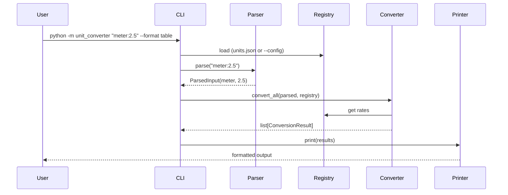

# 설계 문서 — Unit Converter

> **단계:** PRD → **설계 (OCP/SRP)** → TDD (ARRR)  
> **목표:** PRD의 FR/NFR을 추적 가능한 Python 패키지 구조로 매핑한다.  
> **범위:** 본 PR은 **구조 제안 및 요구사항 매핑**만 포함하며, 구현·테스트는 다음 단계(TDD)에서 진행한다.

---

## 1. 패키지 구조

```
unit_converter/
├── __init__.py              # 공개 API 노출
├── __main__.py              # `python -m unit_converter` 진입점
├── cli.py                   # CLI 인자 파싱 및 오케스트레이션
├── models.py                # 도메인 값 객체 (ParsedInput, ConversionResult)
├── errors.py                # 도메인 예외 정의
│
├── parser.py                # [SRP] 입력 문자열 파싱
├── registry.py              # [SRP] 단위 등록·조회
├── converter.py             # [SRP] 환산 연산
│
├── config/
│   ├── __init__.py
│   ├── loader.py            # [OCP] JSON/YAML 설정 로더
│   └── units.json           # 기본 단위 정의 (meter 기준)
│
└── printer/
    ├── __init__.py          # Printer 팩토리
    ├── base.py              # [OCP] 출력 포맷 Protocol/ABC
    ├── table.py             # 기본 table 출력
    ├── json_printer.py
    └── csv_printer.py

tests/                       # TDD 단계에서 FR/NFR별 테스트 추가
├── conftest.py
├── test_parser.py
├── test_registry.py
├── test_converter.py
├── test_printer.py
├── test_config_loader.py
└── test_cli.py
```

---

## 2. 컴포넌트 책임 (SRP)

| 컴포넌트 | 단일 책임 | 알지 못하는 것 |
|----------|-----------|----------------|
| **Parser** | `unit:value` 문자열을 검증·파싱하여 `ParsedInput` 반환 | 단위 환산율, 출력 형식 |
| **Registry** | 단위 이름과 meter 대비 비율 저장·조회·동적 등록 | 입력 파싱, 출력 포맷 |
| **Converter** | Registry를 통해 meter 경유 환산 수행 | 입력 파싱, 출력 포맷 |
| **Printer** | `ConversionResult` 목록을 지정 형식으로 직렬화 | 환산 로직, 단위 등록 |
| **ConfigLoader** | 외부 파일(JSON/YAML)에서 단위 정의 로드 | CLI, 출력 |
| **CLI** | 인자 처리 후 위 컴포넌트를 조합·실행 | 각 컴포넌트 내부 구현 |

### 의존 방향

```
CLI
 ├─→ Parser
 ├─→ Registry ←─ ConfigLoader
 ├─→ Converter (Registry 주입)
 └─→ Printer (포맷별 구현체 선택)
```

---

## 3. OCP 적용 전략

### 3.1 단위 확장 (NFR-01, EXT-02)

- 모든 단위는 **meter 대비 비율**로 Registry에 등록한다.
- `Converter`는 `Registry.get_all_except(source)` + `to_meter()` / `from_meter()` 만 사용한다.
- **새 단위 추가 시 `Converter` 코드 수정 불필요:**
  - `units.json`에 항목 추가 (EXT-01), 또는
  - `registry.register("inch", 0.0254)` 호출 (EXT-02)

```python
# registry.py (인터페이스 스케치)
class UnitRegistry:
    def register(self, name: str, meters_per_unit: float) -> None: ...
    def get(self, name: str) -> float: ...          # FR-03: 미등록 시 예외
    def all_units(self) -> dict[str, float]: ...
```

### 3.2 출력 포맷 확장 (EXT-03)

- `printer/base.py`에 `Printer` Protocol 정의:

```python
class Printer(Protocol):
    def print(self, source: ParsedInput, results: list[ConversionResult]) -> str: ...
```

- `table`, `json`, `csv`는 각각 독립 모듈. `--format` 값에 따라 팩토리가 구현체를 선택한다.
- **새 포맷 추가 시** `printer/xml.py` 등을 추가하고 팩토리에만 등록 — 기존 Printer·Converter 수정 없음.

### 3.3 설정 소스 확장 (EXT-01)

- `ConfigLoader`를 Protocol로 분리하여 JSON/YAML 로더를 교체·추가 가능하게 한다.

---

## 4. 핵심 도메인 모델

```python
# models.py (스케치)
@dataclass(frozen=True)
class ParsedInput:
    unit: str
    value: float

@dataclass(frozen=True)
class ConversionResult:
    source_unit: str
    source_value: float
    target_unit: str
    target_value: float
```

```python
# errors.py (스케치)
class UnitConverterError(Exception): ...
class InvalidFormatError(UnitConverterError): ...    # FR-05
class NegativeValueError(UnitConverterError): ...    # FR-04
class UnknownUnitError(UnitConverterError): ...        # FR-03
```

---

## 5. 환산 규칙

- **기준 단위:** meter
- **기본 환산율 (units.json):**
  - `meter`: 1.0
  - `feet`: 0.3048  (1 m = 3.28084 ft)
  - `yard`: 0.9144  (1 m = 1.09361 yd)
- **간접 환산:** feet ↔ yard 등 비기준 단위 간 변환은 반드시 meter를 경유한다.

```
source_value → [to_meter] → meter_value → [from_meter] → target_value
```

---

## 6. CLI 인터페이스

```bash
# 기본 사용 (table 출력)
python -m unit_converter "meter:2.5"

# 출력 형식 지정 (P1)
python -m unit_converter "meter:2.5" --format json
python -m unit_converter "meter:2.5" --format csv
python -m unit_converter "meter:2.5" --format table

# 외부 설정 파일 (P1)
python -m unit_converter "meter:2.5" --config path/to/units.yaml
```

**기대 출력 (table, 예시):**
```
2.5 meter = 8.2021 feet
2.5 meter = 2.7340 yard
```

---

## 7. FR / NFR / EXT → 컴포넌트 매핑

### Functional Requirements (P0)

| ID | 요구사항 | 담당 모듈 | 설계 대응 |
|----|----------|-----------|-----------|
| **FR-01** | `unit:value` 파싱 | `parser.py` | `Parser.parse(raw) -> ParsedInput` |
| **FR-02** | 등록된 모든 단위로 환산·출력 | `converter.py` + `printer/` | `Converter.convert_all()` → `Printer.print()` |
| **FR-03** | 미등록 단위 오류 | `registry.py` | `get()` 시 `UnknownUnitError` |
| **FR-04** | 음수 거부 | `parser.py` | 파싱 후 `value < 0` → `NegativeValueError` |
| **FR-05** | 잘못된 형식 오류 | `parser.py` | 정규식/분리 실패 → `InvalidFormatError` |

### Non-Functional Requirements (P0)

| ID | 요구사항 | 설계 대응 |
|----|----------|-----------|
| **NFR-01** | OCP — 단위 추가 시 기존 코드 비수정 | `UnitRegistry` + `units.json` / `register()`; `Converter`는 Registry 인터페이스에만 의존 |
| **NFR-02** | SRP — Parser / Registry / Converter / Printer 분리 | §2 컴포넌트 책임 표; 모듈 1:1 대응 |

### Extension Requirements (P1)

| ID | 요구사항 | 담당 모듈 | 설계 대응 |
|----|----------|-----------|-----------|
| **EXT-01** | `units.json` / YAML 로드 | `config/loader.py` | `JsonConfigLoader`, `YamlConfigLoader` → Registry 초기화 |
| **EXT-02** | 런타임 단위 등록 | `registry.py` | `register("cubit", 0.4572)` 후 즉시 변환 가능 |
| **EXT-03** | `--format json\|csv\|table` | `printer/` + `cli.py` | `Printer` Protocol + 팩토리 패턴 |

---

## 8. 테스트 추적성 (TDD 단계 예고)

| 테스트 파일 | 커버 요구사항 |
|-------------|---------------|
| `test_parser.py` | FR-01, FR-04, FR-05 |
| `test_registry.py` | FR-03, EXT-02, NFR-01 |
| `test_converter.py` | FR-02 (환산 정확도, meter 경유) |
| `test_printer.py` | FR-02 (출력), EXT-03 |
| `test_config_loader.py` | EXT-01 |
| `test_cli.py` | E2E: CLI 진입점, `--format`, `--config` |

---

## 9. 실행 흐름



---

## 10. 본 PR 범위 / 비범위

| 포함 | 미포함 (다음 단계) |
|------|-------------------|
| 패키지 디렉터리 골격 | 실제 환산·파싱 로직 구현 |
| 모듈별 docstring (책임 명시) | RED/GREEN/REFACTOR 테스트 |
| `units.json` 기본 정의 | CI 파이프라인 |
| FR/NFR 매핑 문서 | 성능·보안 등 추가 NFR |
